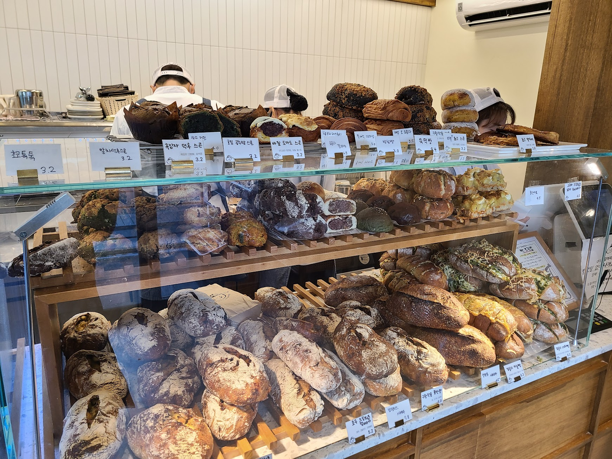
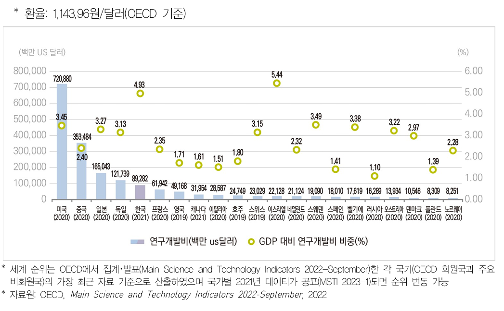
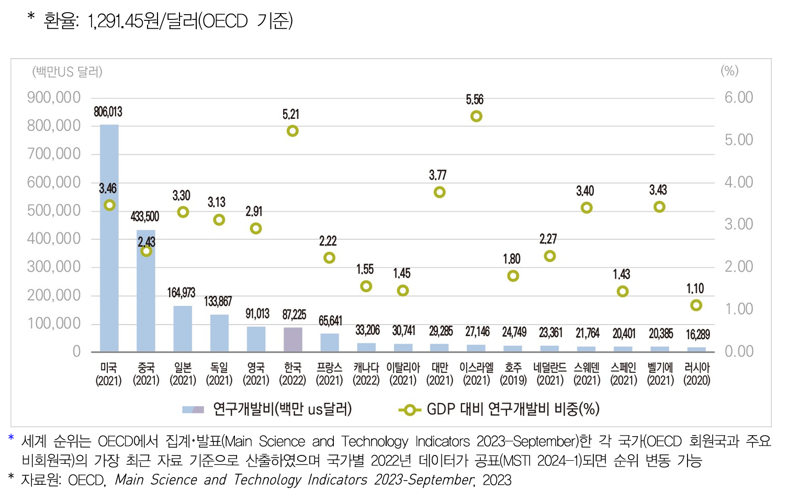
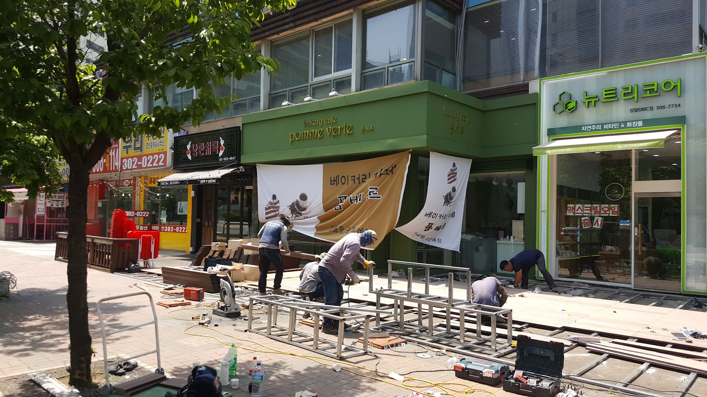
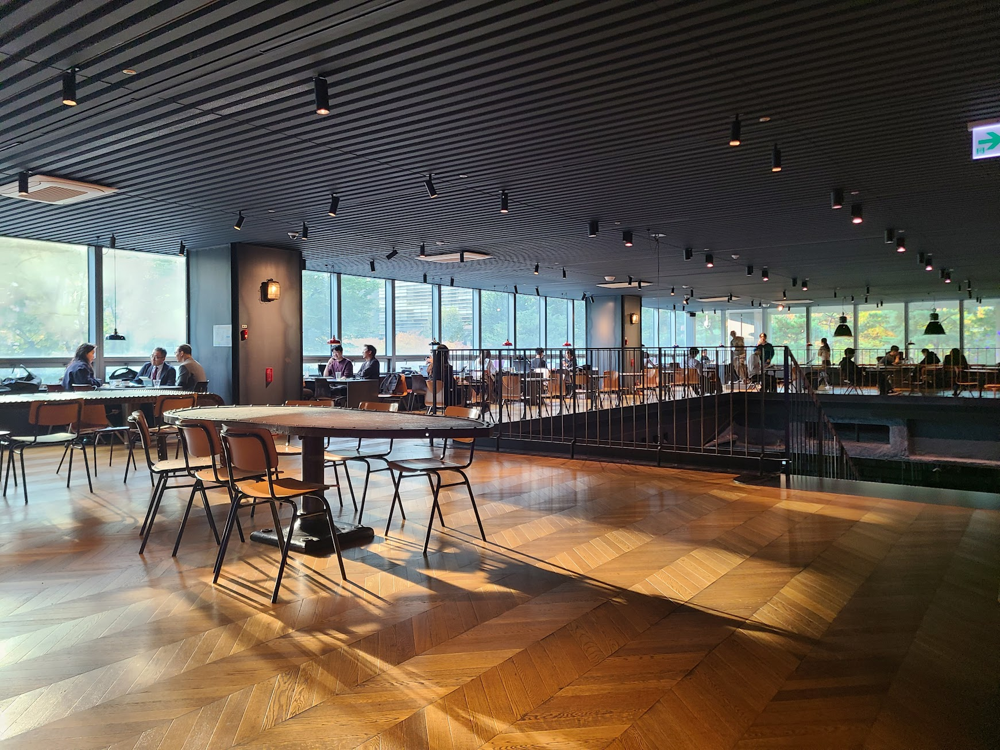
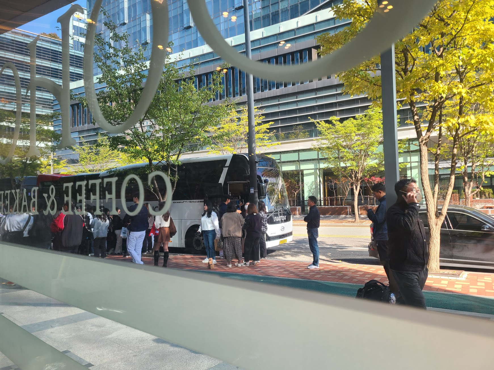

## 문제 1

Q: 다음 이미지에 대한 설명 중 옳지 않은 것은 무엇인가요?
- (1) 많은 사람들이 실내에 모여 앉아 있습니다.
- (2) "DIVE 2024 IN BUSAN"이라는 문구가 보입니다.
- (3) 사람들이 공연을 보고 있는 모습입니다.
- (4) 천장에 여러 개의 조명이 보입니다.

Listening: Which of the following descriptions of the image is incorrect?
- (1) Many people are gathered indoors and seated.
- (2) The text "DIVE 2024 IN BUSAN" is visible.
- (3) People are watching a performance.
- (4) There are multiple lights on the ceiling.

정답: (3) 사람들은 공연을 보고 있는 것이 아니라, 어떤 행사에 참석해 앉아 있습니다.

----------------

## 문제 2

Q : 다음 이미지에 대한 설명 중 옳지 않은 것은 무엇인가요?
- (1) 빨간색 벽돌로 된 건물이 보입니다.
- (2) 노란색 조형물이 있습니다. 
- (3) "Local Stitch"라는 문구가 건물에 적혀 있습니다.
- (4) 조형물은 파란색입니다.

Listening: Which of the following descriptions of the image is incorrect?
- (1) A building made of red brick is visible.
- (2) There is a yellow sculpture.
- (3) The words "Local Stitch" are displayed on the building.
- (4) The sculpture is blue.

정답: (4) 조형물은 파란색이 아닌 노란색입니다.

----------------

## 문제 3

Q: 다음 이미지에 대한 설명 중 옳지 않은 것은 무엇인가요?
- (1) 카페 내부에 사람들이 앉아 있습니다.
- (2) 벽이 노란색으로 칠해져 있습니다.
- (3) 직원이 검정색 옷을 입고 있습니다.
- (4) 창문이 여러 개 보입니다.

Listening: Which of the following descriptions of the image is incorrect?
- (1) People are sitting inside a cafe.
- (2) The wall is painted yellow.
- (3) An employee is wearing black clothes.
- (4) Several windows are visible.

정답: (1) 카페 내부에 사람들이 앉아 있지 않습니다.

----------------

## 문제 4

Q: 다음 이미지에 대한 설명 중 옳지 않은 것은 무엇인가요?
- (1) 건물은 빨간색 벽돌로 되어 있습니다.
- (2) 가게 이름은 'PERSONAL COFFEE'입니다.
- (3) 건물 앞 도로에는 차가 여러 대 주차되어 있습니다.
- (4) 건물은 코너에 위치해 있습니다.

Listening: Which of the following descriptions of the image is incorrect?
- (1) The building is made of red brick.
- (2) The store name is 'PERSONAL COFFEE.'
- (3) There are multiple cars parked on the road in front of the building.
- (4) The building is located on a corner.

정답: (3) 건물 앞 도로에는 주차된 차가 없습니다.

----------------

## 문제 5

Q : 다음 이미지에 대한 설명 중 옳지 않은 것은 무엇인가요?
- (1) 다양한 종류의 빵이 진열되어 있습니다.
- (2) 계산대 앞에 두 명의 직원이 서 있습니다.
- (3) 빵 위에 가격표가 붙어 있습니다.
- (4) 직원들은 모자를 쓰고 있습니다.

Listening : Which of the following descriptions of the image is incorrect?
- (1) Various types of bread are displayed.
- (2) There are two employees standing in front of the counter.
- (3) Price tags are attached to the bread.
- (4) The employees are wearing hats.

정답: (2) 계산대 앞에 두 명의 직원이 서 있는 것이 아니라 보이지 않습니다.

----------------

## 문제 6

Q: 다음 이미지에 대한 설명 중 옳지 않은 것은 무엇인가요?
- (1) 미국은 연구개발비가 720,880 백만 달러입니다.
- (2) 이스라엘의 GDP 대비 연구개발비 비중은 5.44%입니다.
- (3) 중국의 연구개발비는 프랑스보다 낮습니다.
- (4) 한국의 연구개발비는 89,282 백만 달러입니다.

Listening: Which of the following descriptions of the image is incorrect?
- (1) The research and development expenditure for the USA is 720,880 million dollars.
- (2) Israel's R&D expenditure as a percentage of GDP is 5.44%.
- (3) China's R&D expenditure is lower than that of France.
- (4) South Korea's research expenditure is 89,282 million dollars.

정답: (3) 중국의 연구개발비는 프랑스보다 높습니다.

----------------

## 문제 7

Q : 다음 이미지에 대한 설명 중 옳지 않은 것은 무엇인가요?
- (1) 미국의 연구개발비는 약 720,880백만 달러입니다.
- (2) 한국의 GDP 대비 연구개발비 비중은 4.93%입니다.
- (3) 프랑스의 연구개발비는 독일보다 많습니다.
- (4) 일본의 연구개발비는 약 165,043백만 달러입니다.

Listening : Which of the following descriptions of the image is incorrect?
- (1) The United States' R&D expenditure is approximately $720,880 million.
- (2) South Korea's R&D expenditure as a percentage of GDP is 4.93%.
- (3) France's R&D expenditure is higher than Germany's.
- (4) Japan's R&D expenditure is approximately $165,043 million.

정답: (3) 프랑스의 연구개발비는 독일보다 적습니다.

----------------

## 문제 8

Q : 다음 이미지에 대한 설명 중 옳지 않은 것은 무엇인가요?
- (1) 미국의 연구개발비는 806,013백만 US 달러입니다.
- (2) 중국은 연구개발비의 GDP 대비 비중이 2.43%입니다.
- (3) 프랑스의 연구개발비는 133,867백만 US 달러입니다.
- (4) 이스라엘은 연구개발비의 GDP 대비 비중이 5.56%입니다.

Listening: Which of the following descriptions of the image is incorrect?
- (1) The research and development expenditure of the USA is 806,013 million US dollars.
- (2) China's research and development expenditure as a percentage of GDP is 2.43%.
- (3) France's research and development expenditure is 133,867 million US dollars.
- (4) Israel's research and development expenditure as a percentage of GDP is 5.56%.

정답: (3) 프랑스의 연구개발비는 65,641백만 US 달러입니다.

----------------

## 문제 9

Q: 다음 이미지에 대한 설명 중 옳지 않은 것은 무엇인가요?
- (1) 미국의 연구개발비는 약 800,000백만 US달러입니다.
- (2) 중국의 GDP 대비 연구개발비 비중은 2.43%입니다.
- (3) 한국의 연구개발비는 약 130,000백만 US달러입니다.
- (4) 일본의 GDP 대비 연구개발비 비중은 3.13%입니다.

Listening: Which of the following descriptions of the image is incorrect?
- (1) The research and development expenditure of the USA is about 800,000 million USD.
- (2) China's R&D expenditure ratio to GDP is 2.43%.
- (3) Korea's research and development expenditure is about 130,000 million USD.
- (4) Japan's R&D expenditure ratio to GDP is 3.13%.

정답: (3) 한국의 연구개발비는 약 91,013백만 US달러입니다.

----------------

## 문제 10

Q: 다음 이미지에 대한 설명 중 옳지 않은 것은 무엇인가요?
- (1) 사람들이 건물 앞에서 작업을 하고 있습니다.
- (2) 베이커리 카페의 이름은 'pomne verte'입니다.
- (3) '뉴트리코어'라는 상점이 보입니다.
- (4) 광고 배너에 과일 그림이 표시되어 있습니다.

Listening: Which of the following descriptions of the image is incorrect?
- (1) People are working in front of a building.
- (2) The name of the bakery café is 'pomne verte.'
- (3) There is a store called '뉴트리코어.'
- (4) The advertisement banner shows pictures of fruit.

정답: (4) 광고 배너에 과일 그림이 아닌 커피 컵 그림이 표시되어 있습니다.

----------------

## 문제 11

Q: 다음 이미지에 대한 설명 중 옳지 않은 것은 무엇인가요?
- (1) 사람들이 카페에서 앉아 있습니다.
- (2) 카페는 밝고 넓은 공간입니다.
- (3) 테이블 위에 여러 가지 음식이 놓여 있습니다.
- (4) 창문을 통해 자연광이 들어오고 있습니다.

Listening: Which of the following descriptions of the image is incorrect?
- (1) People are sitting in a cafe.
- (2) The cafe is a bright and spacious area.
- (3) Various foods are placed on the table.
- (4) Natural light is coming through the windows.

정답: (3) 테이블 위에 음식이 놓여 있지 않습니다.

----------------

## 문제 12

Q : 다음 이미지에 대한 설명 중 옳지 않은 것은 무엇인가요?
- (1) 사람들은 버스 옆에서 줄을 서 있는 모습입니다.
- (2) 유리창에 "COFFEE BAKERY"라고 적혀 있습니다.
- (3) 한 사람이 핸드폰으로 통화 중입니다.
- (4) 사람들이 줄을 서 있는 곳은 지하철역입니다.

Listening : Which of the following descriptions of the image is incorrect?
- (1) People are lined up next to a bus.
- (2) The window has "COFFEE BAKERY" written on it.
- (3) One person is talking on a phone.
- (4) The location where people are lining up is a subway station.

정답: (4) 사람들이 줄을 서 있는 곳은 버스 정류장입니다.

----------------

