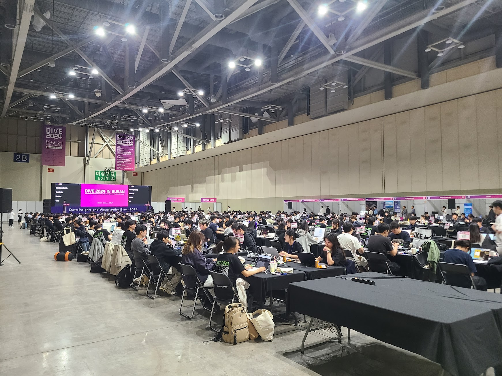
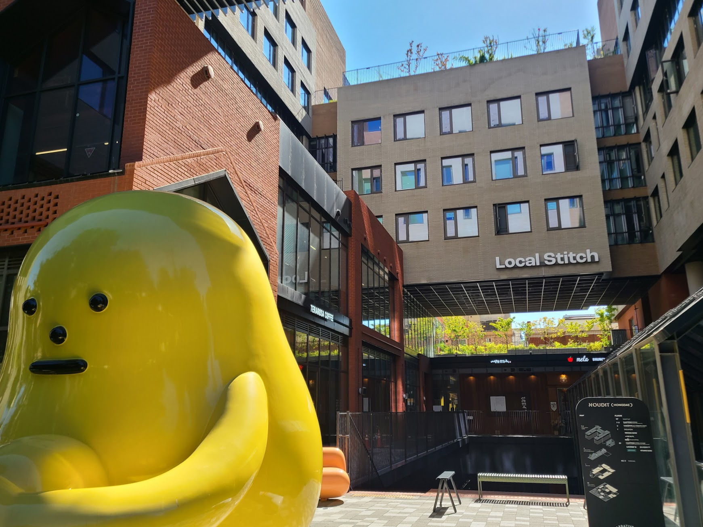
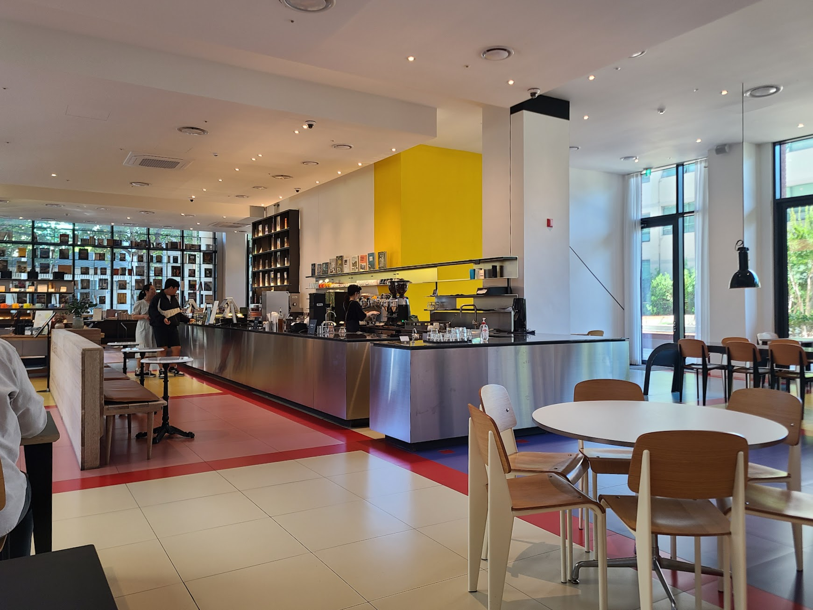
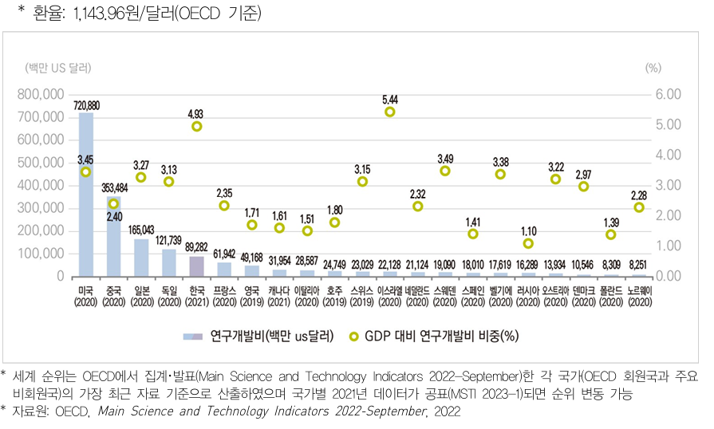
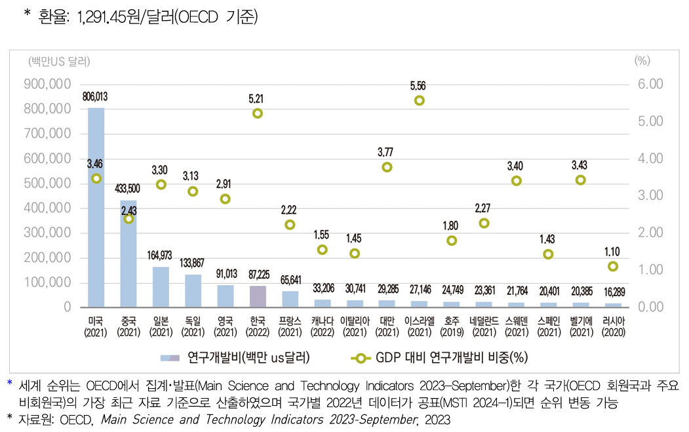

## 문제 1



Q: 다음 이미지에 대한 설명 중 옳지 않은 것은 무엇인가요?
- (1) 사람들은 테이블에 앉아 컴퓨터를 사용하고 있는 모습입니다.
- (2) 천장에 조명이 많이 설치되어 있습니다.
- (3) 'DIVE 2024 IN BUSAN'이라는 문구가 보입니다.
- (4) 벽에는 장식 그림들이 걸려있습니다.

Listening: Which of the following descriptions of the image is incorrect?
- (1) It shows people sitting at tables using computers.
- (2) There are many lights installed on the ceiling.
- (3) You can see the phrase 'DIVE 2024 IN BUSAN'.
- (4) There are decorative paintings hung on the wall.

정답: (4) 벽에는 장식 그림이 아닌 큰 글자가 적힌 배너들이 걸려있습니다.

----------------

## 문제 2



Q: 다음 이미지에 대한 설명 중 옳지 않은 것은 무엇인가요?
- (1) 노란색 조형물이 보입니다.
- (2) 건물의 이름이 'Local Stitch' 입니다.
- (3) 빨간색 벽돌로 된 건물이 있습니다.
- (4) 조형물은 회색입니다.

Listening: Which of the following descriptions of the image is incorrect?
- (1) A yellow sculpture is visible.
- (2) The building is named 'Local Stitch'.
- (3) There is a building made of red bricks.
- (4) The sculpture is gray.

정답: (4) 조형물은 회색이 아닌 노란색입니다.

----------------

## 문제 3



Q: 다음 이미지에 대한 설명 중 옳지 않은 것은 무엇인가요?
- (1) 카운터 뒤에 있는 벽은 노란색입니다.
- (2) 여러 개의 테이블과 의자가 놓여 있습니다.
- (3) 사람들이 자유롭게 앉아 있습니다.
- (4) 카페 내부에 큰 창문이 있습니다.

Listening: Which of the following descriptions of the image is incorrect?
- (1) The wall behind the counter is yellow.
- (2) There are several tables and chairs placed.
- (3) People are sitting freely.
- (4) There are large windows in the cafe.

정답: (3) 사람들이 자유롭게 앉아 있는 모습은 보이지 않습니다.

----------------

## 문제 4


Q: 다음 이미지에 대한 설명 중 옳지 않은 것은 무엇인가요?
- (1) 벽돌로 지어진 건물이 보입니다.
- (2) 건물의 1층에는 커피숍이 있습니다.
- (3) 건물 옥상에는 큰 나무가 자라고 있습니다.
- (4) 건물 앞 도로에는 주황색 원뿔이 보입니다.

Listening: Which of the following descriptions of the image is incorrect?
- (1) The building is made of bricks.
- (2) There is a coffee shop on the first floor of the building.
- (3) There is a large tree growing on the building's roof.
- (4) An orange cone is visible on the road in front of the building.

정답: (3) 건물 옥상에는 큰 나무가 없습니다.

----------------

## 문제 5


Q : 다음 이미지에 대한 설명 중 옳지 않은 것은 무엇인가요?
- (1) 다양한 종류의 빵이 진열되어 있습니다.
- (2) 점원들이 모자를 쓰고 있습니다.
- (3) 진열된 빵 앞에 손님들이 줄을 서 있습니다.
- (4) 간판에 가격이 적혀 있습니다.

Listening: Which of the following descriptions of the image is incorrect?
- (1) Various types of bread are displayed.
- (2) The clerks are wearing caps.
- (3) There are customers lined up in front of the displayed bread.
- (4) Prices are written on the signs.

정답: (3) 손님들이 줄을 서 있지 않습니다.

----------------

## 문제 6


Q : 다음 이미지에 대한 설명 중 옳지 않은 것은 무엇인가요?
- (1) 미국의 연구개발비는 720,880백만 US 달러입니다.
- (2) 프랑스의 GDP 대비 연구개발비 비중은 1.71%입니다.
- (3) 스위스의 연구개발비는 24,749백만 US 달러입니다.
- (4) 이탈리아의 GDP 대비 연구개발비 비중은 2.35%입니다.

Listening : Which of the following descriptions of the image is incorrect?
- (1) The R&D expenditure of the United States is 720,880 million US dollars.
- (2) France's R&D expenditure as a percentage of GDP is 1.71%.
- (3) Switzerland's R&D expenditure is 24,749 million US dollars.
- (4) Italy's R&D expenditure as a percentage of GDP is 2.35%.

정답: (4) 이탈리아의 GDP 대비 연구개발비 비중은 1.51%입니다.

----------------

## 문제 7



Q : 다음 이미지에 대한 설명 중 옳지 않은 것은 무엇인가요?
- (1) 미국의 연구개발비는 720,880백만 US 달러입니다.
- (2) 프랑스의 GDP 대비 연구개발비 비중은 2.35%입니다.
- (3) 한국의 연구개발비는 165,043백만 US 달러입니다.
- (4) 노르웨이의 GDP 대비 연구개발비 비중은 4.93%입니다.

Listening : Which of the following descriptions of the image is incorrect?
- (1) The R&D expenditure of the USA is 720,880 million USD.
- (2) France's GDP proportion for R&D expenditure is 2.35%.
- (3) Korea's R&D expenditure is 165,043 million USD.
- (4) Norway's GDP proportion for R&D expenditure is 4.93%.

정답: (4) 노르웨이의 GDP 대비 연구개발비 비중은 1.79%입니다.

----------------

## 문제 8



Q: 다음 그래프에 대한 설명 중 옳지 않은 것은 무엇인가요?
- (1) 미국의 연구개발비는 806,013백만 US 달러입니다.
- (2) 이스라엘의 GDP 대비 연구개발비 비중은 3.77%입니다.
- (3) 영국의 연구개발비는 91,013백만 US 달러입니다.
- (4) 프랑스의 GDP 대비 연구개발비 비중은 2.22%입니다.

Listening: Which of the following descriptions of the graph is incorrect?
- (1) The U.S. research and development expenditure is 806,013 million USD.
- (2) Israel's R&D expenditure as a percentage of GDP is 3.77%.
- (3) The U.K.'s research and development expenditure is 91,013 million USD.
- (4) France's R&D expenditure as a percentage of GDP is 2.22%.

정답: (2) 이스라엘의 GDP 대비 연구개발비 비중은 3.77%가 아닌 5.56%입니다.

----------------

## 문제 9


Q: 다음 이미지에 대한 설명 중 옳지 않은 것은 무엇인가요?
- (1) 미국의 연구개발비는 8,060억 달러입니다.
- (2) 한국의 GDP 대비 연구개발비 비중은 2.91%입니다.
- (3) 프랑스의 연구개발비는 8,722.5백만 달러입니다.
- (4) 캐나다의 GDP 대비 연구개발비 비중은 1.55%입니다.

Listening: Which of the following descriptions of the image is incorrect?
- (1) The R&D expenditure of the USA is 806 billion USD.
- (2) South Korea has an R&D expenditure to GDP ratio of 2.91%.
- (3) France's R&D expenditure is 8,722.5 million USD.
- (4) Canada has an R&D expenditure to GDP ratio of 1.55%.

정답: (3) 프랑스의 연구개발비는 8,722.5백만 달러가 아닌 6,564.1백만 달러입니다.

----------------

## 문제 10


Q : 다음 이미지에 대한 설명 중 옳지 않은 것은 무엇인가요?
- (1) 사람들이 건물 앞에서 작업을 하고 있습니다.
- (2) 모습이 붉은 건물이 두 번째로 보입니다.
- (3) 건물 위에 있는 간판은 초록색입니다.
- (4) 바닥에 공구들이 흩어져 있습니다.

Listening : Which of the following descriptions of the image is incorrect?
- (1) People are working in front of a building.
- (2) A red building is seen as the second one.
- (3) The sign above the building is green.
- (4) Tools are scattered on the ground.

정답: (2) 두 번째로 보이는 건물은 검은색 간판을 가지고 있습니다.

----------------

## 문제 11


Q : 다음 이미지에 대한 설명 중 옳지 않은 것은 무엇인가요?
- (1) 커피숍 내부의 모습이 담겨 있습니다.
- (2) 사람들이 창가에 앉아 대화를 나누고 있습니다.
- (3) 바닥은 나무 무늬로 되어 있습니다.
- (4) 사람들이 줄을 서서 음식을 받고 있습니다.

Listening : Which of the following descriptions of the image is incorrect?
- (1) It shows the interior of a coffee shop.
- (2) People are sitting by the window having a conversation.
- (3) The floor has a wooden pattern.
- (4) People are lining up to receive food.

정답: (4) 사람들이 줄을 서서 음식을 받고 있는 모습은 없습니다.

----------------

## 문제 12


```
Q: 다음 이미지에 대한 설명 중 옳지 않은 것은 무엇인가요?
- (1) 사람들이 버스에 탑승하기 위해 줄을 서 있습니다.
- (2) 창문에 'COFFEE & BAKERY'라는 문구가 보입니다.
- (3) 나무가 전혀 보이지 않습니다.
- (4) 일부 사람들이 스마트폰을 손에 들고 있습니다.

Listening: Which of the following descriptions of the image is incorrect?
- (1) People are lining up to board a bus.
- (2) The window has the text 'COFFEE & BAKERY' written on it.
- (3) There are no trees visible.
- (4) Some people are holding smartphones.

정답: (3) 나무가 여러 그루 보입니다.
```

----------------

